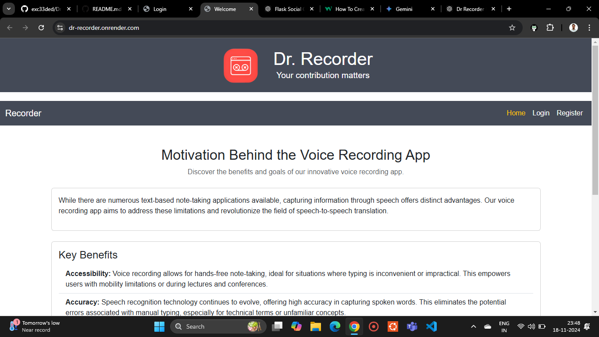
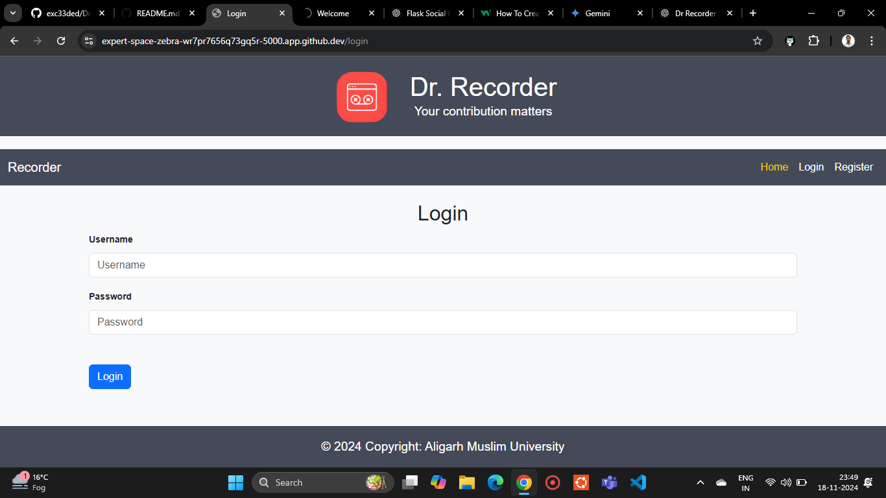
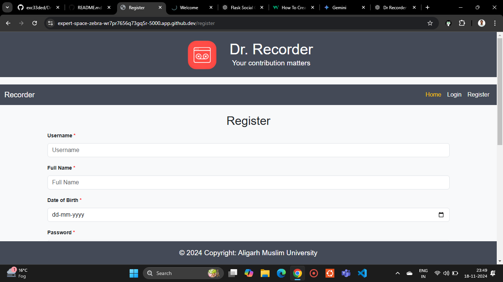
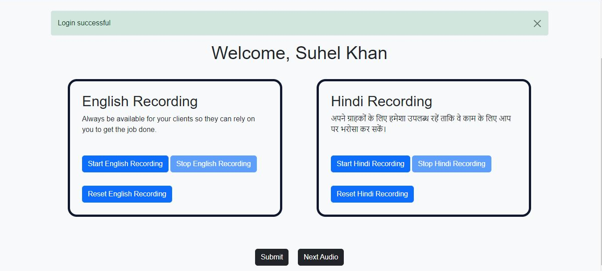

# Dr. Recorder 🎙️

- Dr. Recorder is an intuitive and versatile application designed to seamlessly capture and store audio recordings in both Hindi and English. It serves as a comprehensive database for managing your audio files, while also bridging the gap between Hindi and English through direct speech-to-speech translation. Whether for personal use, professional needs, or language learning, Dr. Recorder makes audio recording, storage, and translation effortless and efficient.

---

## Table of Contents

- [Dr. Recorder 🎙️](#dr-recorder-️)
  - [Table of Contents](#table-of-contents)
  - [Features](#features)
  - [**Installation**](#installation)
  - [**Usage**](#usage)
  - [**Configuration**](#configuration)
  - [**Troubleshooting**](#troubleshooting)
  - [**Contributing**](#contributing)
  - [**License**](#license)
  - [**Project Structure**](#project-structure)
  - [**Preview**](#preview)
    - [Welcome Page](#welcome-page)
    - [Login Page](#login-page)
    - [Register Page](#register-page)
    - [Index Page](#index-page)

## Features

- 🎤 Easy-to-use audio recording functionality
- ⚙️ Customizable settings for optimal recording
- 📁 Save recordings in multiple formats
- 🖥️ Command-line and optional GUI support
- 🌐 Speech-to-speech translation between Hindi and English

## **Installation**

- Dr. Recorder requires a few things to run smoothly:

1. **Prerequisites:**

   - Python 3.x
   - pip (Python package manager)

2. **Installation:**
   - Clone the repository:
     ```bash
     git clone https://github.com/exc33ded/Dr-Recorder
     ```
   - Install dependencies:
     ```bash
     cd Dr-Recorder
     pip install -r requirements.txt
     ```

## **Usage**

- Now that everything is set up, you're ready to start recording!

Run the application:

In your terminal window, type this command and press Enter:

```bash
python app.py
```

## **Configuration**

- Dr. Recorder allows you to customize various settings to suit your needs. Configuration options can be found in the `config.json` file. Here are some key settings:
  - `audio_format`: Specify the format for saving recordings (e.g., `wav`, `mp3`).
  - `language`: Set the default language for recordings (`en` for English, `hi` for Hindi).
  - `gui_enabled`: Enable or disable the graphical user interface (`true` or `false`).

## **Troubleshooting**

- If you encounter any issues, try the following steps:
  - Ensure all prerequisites are installed correctly.
  - Check for any

## **Contributing**

We welcome contributions! Follow these steps to contribute:

1. Fork the repository.
2. Create a new branch.
3. Submit a pull request.

## **License**

This project is licensed under the MIT License. See the `LICENSE` file for more details.

## **Project Structure**

- The project directory structure is as follows:
  ```
  Dr-Recorder/
  ├── app.py
  ├── config.json
  ├── requirements.txt
  ├── README.md
  ├── LICENSE
  ├── /snapshot
  │   ├── image.png
  │   ├── image-1.png
  │   ├── image-2.png
  │   └── image-3.png
  └── /src
      ├── recorder.py
      ├── translator.py
      └── gui.py
  ```

## **Preview**

Below is a sneak peek of Dr. Recorder in action, showcasing its user-friendly interface and seamless functionality:

**Command-Line Interface (CLI)**
The command-line version of Dr. Recorder allows you to start, pause, and stop recordings easily using simple commands.

**Graphical User Interface (GUI) (Optional)**
The GUI mode provides an intuitive interface for recording and managing your audio files.

**Recording in Progress**
Real-time recording with visual indicators to track your progress.

**Submit Recordings**
Submit all your saved audio files in an organized manner. These recordings will help us to trained a **Deep Learning** model for translating speech to text.

### Welcome Page



### Login Page



### Register Page



### Index Page


